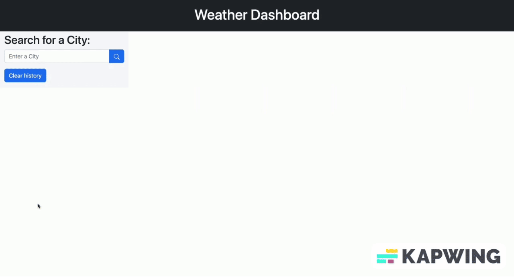

  

  

<h1>
  hey there
  
</h1>

  

# Hi, it's my "Weather Dashboard" app.

A web-based dashboard built to show the current weather in a city of choice and the upcoming five (5) day forecast for that city.

Enter in your city of choice and select search to view the current weather, temperature, humidity, wind speed, and UV Index for that city at the current time. Upon the search, the dashobard will also display the weather, temperature and hummidity forecast for the next five(5) days.

Previous searches are saved in localStorage and the five (5) most recent searches are available as buttons in order for easy access and re-searching of weather and forecasts

## Built With

- HTML
- CSS
- Javascript
- Open Weather API
- Bootstrap API
- Moment.js API
  

My app at github repository: https://github.com/Havrushchenko/weather-dashboard

My app is live at github pages: https://havrushchenko.github.io/weather-dashboard/